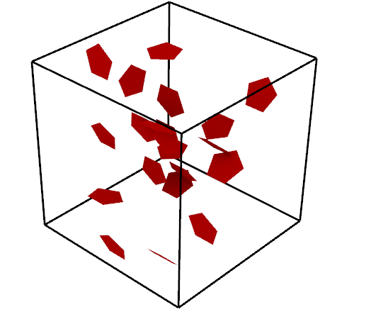
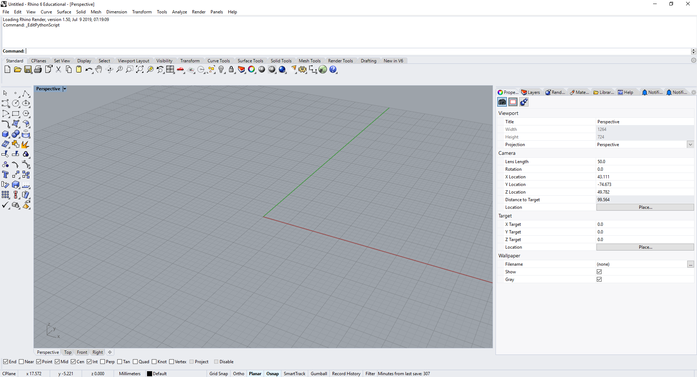
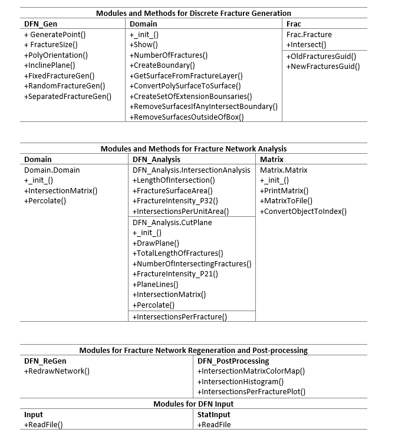

# A Discrete Fracture Network Generation and Analysis Library for Use in CAD Software Environments

# Author: 

Name: Falola Yusuf

Email address: fyf17@ic.ac.uk

CID: 01481781


# Introduction

This work proposes an easy to use, open sourced library, Y-Frac, for DFN modelling and analysis. Y-Frac is built upon the python APIs available on Rhinoceros 6. Hence, Y-Frac is fit for use on Rhinoceros software package. Y-Frac can model fracture networks containing circular, elliptical and regular polygonal fractures. This library is computationally cheap for DFN modelling and analysis. Some of the functionalities of this library for DFN analysis include fracture intersection analysis, cut-plane analysis, and percolation analysis. The output text file from this library containing modelled fracture networks’ parameters can serve as input for appropriate software packages to simulate flow and perform mechanical analysis in fracture networks.



# Requirements
This library expands on Rhiniceros (Rhino) 6 python API. Hence, users need to install the software before using this library.

- Rhinoceros 6 for windows, can be donloaded [here](https://www.rhino3d.com/download)
- Rhinoceros 6 for windows hardware requirements can be found [here](https://www.rhino3d.com/6/system_requirements)
- Rhinoceros 6 python API documentation can be found [here](https://developer.rhino3d.com/api/RhinoScriptSyntax/) 
- Users can look up Rhino [user guide](http://docs.mcneel.com/rhino/6/usersguide/en-us/index.htm)
- matplotlib >= 3.0.2 for postprocessing

# Installation
- Clone this repository to your computer using the following on the command line.

`git clone http://github.com/msc-acse/acse-9-independent-research-project-Falfat.git`

- The contents in the file should be copied to the Rhinoceros 6 script folder for use, as described below

`~\McNeel\Rhinoceros\6.0\scripts`

# Usage
- Once the files are in the Rhino's script folder. Users should open the Rhino software and maneuver to the Rhino python scripting platform, described as follows

` Tools >> PythonScript >> Edit `



- A second interface will pop up for python scripting. Users can then access the Rhinopython script folder by clicking

`File >> Open >> ~\McNeel\Rhinoceros\6.0\scripts`

- A new file can then be open to access the Y-Frac modules saved in the Y-Frac folder. To open a new Rhino python scripting file:

`File >> New..`

- The Rhino python scripting platform does not support matplotlib package for visualisations. Therefore, the postprocesing module `PostProcessing.py` should be used on a IDE that supports matplotlib.

- The `input_file` folder contains two text files that to specify fracture parameters and statistical distribution for the library. It is advisable that these files should be copied to the Y-Frac folder for easy access by the modules. The instructions on how to fill these text files is contained in the files.

- Y-Frac outputs a text file which contains domain size, fracture_shape, fracture orienations, planes and sizes for fracture regeneration and input to more complex software packages for flow simulation and geomechanical anlysis of fracture networks.

- The `percolation_analysis` and `analysis_script` folders contain some DFN analysis done with Y-Frac. Each of the file is well commented to describe the analysis contained in it. Basically, these folders and the test folder, `test_scripts` should be unbundled into the `Y-Frac` folder which conatins the modules. The `test_scripts` contains some files to test the functionalities of the methods in this library.

- The `text_files` folder contain is where the output file named `fracture_data` is written. It also contains some text files used for analysis to demonstrated Y-Frac's functionalities. Again, it is prefered this folder be copied into `Y-Frac` folder for easy accessibility.

- Users should endeavor to change `paths` of text files where required.

## Example: Generating fixed number of fractures
```python
# create an instance of domain
dom = Domain.Domain(boxlength) 

# draw domain
#dom.Show() 

# insert 50 fractures in the domain
frac_list = DFN_Gen.FixedFractureGen(50,aspect_ratio=2, sides =5)

# trim out of bounds fractures
dom.RemoveSurfacesOutsideOfBox(dom.length)
```


# Documentation
- Full documentation is available in `Y-Frac.html` in `documentation` file.

- Below is the architecture of Y-Frac's library. *The names of modules, methods and functions are intuitive.*



- Documentation for some important methods is shown below:

```python
def FixedFractureGen(frac_num, aspect_ratio=None, sides=None):
    """
    A function to add a fixed number of circles in a cube. It also writes data
    to fracture data text file for regenerating fracture networks.
    
    Parameters
    ----------
    frac_num: int
        number of fractures to generate
    aspect_ratio: float
        aspect ratio for ellipse (Default:None)
    sides: int
        number of sides of polygon to generate (Default:None)
    """
    
    def RandomFractureGen(frac_min, frac_max, radius_min, radius_max,
                      aspect_min=None, aspect_max=None, polysize_min=None,
                      polysize_max=None):
    """
    Funtions to generate fractures of random number and sizes
    
    Parameters
    ----------
    frac_min: int
        minimum number of fractures to generate
    frac_max: int
        maximum number of fractures to generate
    radius_min: float
        minimum size of fractures
    radius_max: float
        maximum number of fractures to generate
    aspect_min: float
        minimum aspect ratio fpr ellipses (Default:None)
    aspect_max: float
        maximum aspect ratio fpr ellipses (Default:None)
    polysize_min: int
        minimum size of polygon (Default:None)
    polysize_max: int
        maximum size of polygon (Default:None)
    """
    
    class Domain:
    """
    A class to represent the farcture network domain.
    .....

   Attributes
   ----------
   length: float
       the length of the fracture domain.
   surface area: float
       total surface area of the fracture domain.
   type: str
       domain shape (default is cube)
   center: list
       center of the domain in 3D space.
   my_fractures: list
       GUIDs of all the fractures persent in the domain.

    Methods
    -------
    Show()
        displays the domain on Rhino interface
    NumberOfFractures()
        returns the total number of fractures in the domain
    CreateBoundary(box_side_length)
        creates boundary for trimming out of bounds fractures.
        An auxilliary method to trim extruding fractures.
    GetSurfaceFromFractureLayer(layer_name)
        gets surfaces from layer and returns the surfaces.
        An auxilliary method to trim extruding fractures.
    ConvertPolysurfaceToSurface(polysurface)
        converts polysurfaces to surface and returns False and surface
        if the argument is a polysurface. Returns True and the argument
        type if it is not a polysurface.
        An auxilliary method to trim extruding fractures.
    CreateSetOfExtendedBoundaries(boundaries)
        creates some extened boundaries to check for out of bounds fractures.
        An auxilliary method to trim extruding fractures.
    RemoveSurfacesIfAnyIntersectBoundary(surf, boundaries)
        checks if a surface intersects the boundary and deletes the surface
        An auxilliary method to trim extruding fractures.
    RemoveSurfacesOutsideOfBox(b_length)
        Main method which calls all auxilliary functions to trim out of bounds
        fractures.
    IntersectionMatrix(boundary_list, domain_fractures)
        method to create a square intersection matrix for fracture-fracture
        and fracture-boundary intersections. Returns the matrix.
    Percolate(initial_guid, target_guid, boundary_list, intersection_matrix,
              domain_fractures)
        method to determine percolation state of the domain. returns a bool.
    """
    def __init__(self, length):
        """
        Parameters
        ----------
        length: float
            the length of the fracture domain.
     
    def Show(self):
        """
        displays the domain on the Rhino user interface.

        Parameters
        ----------
        None
 
 
 class IntersectionAnalysis:
    """
    A class for fracture network intersection analysis
    
    .....

    Attributes
    ----------
    no_of_fracture_intersections: int
        the number of fracture intersections in the network
    lengths_of_intersection_lines : list
        a list of all the length of intersections
    
    Methods
    -------
    LengthOfIntersection(fracture_guid_list)
        returns the sum of all length of intersections and helps to track
        the number of fracture intersections  
    FracturesSurfaceArea(fracture_guid_list)
        determines the total surface area of all fractures in the medium
    FractureIntensity_P32(fracture_guid_list, domain_length, domain_width,
                          domain_height)
        returns the P_32 fracture intensity
    IntersectionsPerUnitArea(fracture_guid_list, domain_length,
                                domain_width, domain_height)
        determines the length of intersections per unit area of the 3D medium
    """
    
  def IntersectionMatrix(self, boundary_list, intersected_fractures):
        """
        Function to perform fracture-fractrure intersection and 
        fracture-boundary intersection, then form an intersection matrix.
        
        Parameters
        ---------
        boundary_list: list
            list of GUIDs of the plane's boundaries
        intersected_fractures: list
            list of GUIDs of the intersecting fractures
        
        Raises
        ------
        TypeError
            if the arguments are not lists
        """
        
   def Percolate(self, initial_guid, target_guid, boundary_list, intersection_matrix, domain_fractures):
        """
        function to determine percolation state of the cut-palne (2D)
        
        Parameters
        ----------
        initial_guid: guid
            guid of the first boundary
        target_guid: guid
            guid of the second boundary
        intersection_matrix: matrix
            intersection matrix
        domain_fractures: list
            list of fractures intersecting the plane
            
        Raises
        ------
        TypeError
            if  arguments 'boundary_list' and 'domain_fractures' are not lists
        """
```
    
  
    
# Acknowledgement
- I appreciate my supervisors, Dr Robin Thomas and Dr Adriana Paluszny for their guidance, advice and push during this project
- Thanks to my classmates for their moral and academic support.
- My family is well appreciated for their support in all ramifications. 

